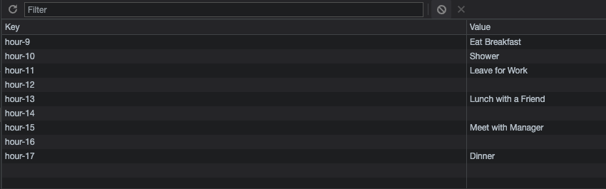

<!-- Name of Application -->

# DAILY TASKS

<!-- Link to Application -->

[Access Daily Tasks Application](https://caseywoodman.github.io/DailyTasks/)

<!-- Purpose of Application -->

## PURPOSE

The purpose of this application is to provide the user with a work day daily task fill in that would keep data throughout a given day. The user can input any information that they would like and save that to local storage. Throughout the day the time of the day will change the blocks so the user can easily see if the event is in the past, present or future.

<!-- My Experience -->

## MY EXPERIENCE

This application was completely created in JavaScript, the HTML code was given by the client. In the JavaScript, Using JQuery, each time-block was grabbed from the HTML and then manipulated.

<!-- Screen Shots -->

## As the actual time changes, So do the colors to represent past, present & future

## When the user Saves the Block, it is stored in local storage

<!-- Created by/ Credits -->

## HTML Provided by Client, JavaScript written by Casey Thomas Woodman
